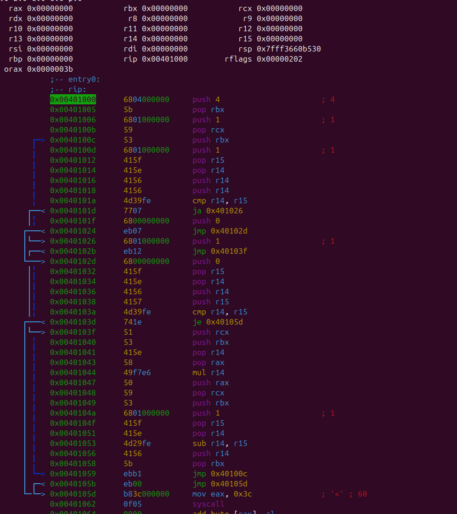

# WhatTheLang (basically just python copy)
```
AUTHOR: BARKIR

MIPT DREC 2025
```

## Preamble
- [Syntax](#used)
- [// TODO](#to-do)
- [Binary Translator](#im-back-bches)

## Used
- [My Assembler](https://github.com/Barkir/SPU-Processor)

## Syntax and how to use

Clone repo using this command
```
git clone https://github.com/Barkir/WhatTheLang2
```

- Language has math operations (+, -, >, < etc.), conditioins (if, while).
- Also you can create functions with param (code example in toRun folder)
- Create variables
  ```
  a = 20;
  b = 30;
  ```
  - Use conditions or while
    ```
    if (a == 20)
    {
      print(a + 30);
      a = 700;
    }

    while (b < 20)
    {
      print(b);
      b = b - 1;
    }
    ```


- This is how you can create functions
```
def function(a, b, c)
{
// your code here
}
```

## To do
- [] iolib linking
- [] debug calls


## Source
Spasibo dedu za Huawei
efefeefe


# IM BACK B%%CHES

# Binary Translator
- Now let's do some real stuff (elff)

Let's see what we have now.

| Language Components |
|---------------------|
| 1 level -> language parser |
| 2 level -> AST-tree representation |
| 3 level -> AST to VM representation |
| 4 level -> VM to own binary representation|

My VM represenation is connected with binary representation.
Let's make translation to **x86-64**

GCC compiler creates **elf** binary file out of our code.
Our compiler should do the same.

## Writing libraries
Starting with our own **IO library** written in **NASM64**.
We need to write to calls - **input** and **output**
They're similar to the ones we use in [purintf](https://github.com/Barkir/Purintf). Although WhatTheLang uses float numbers, let's write all the calls for *integers* at first. It is just easier and faster at this stage.

## ELF-file structure
Simple elf-file consists of:
1. Header
2. Binary code

To read elf-file we can use ```readelf```

First for bytes are defining our file as elf-file

```7f 45 4c 46```

Next byte is defining class field:
|Value |Architecture |
|-------|------------|
01 | 32-bit architecture |
02 | 64-bit architecture |

Next byte is defining data field:

|Value |Data setting |
|-------|------------|
01 | LSB (Little Endian) |
02 | MSB (Big Endian) |

Next byte is for version number and it is always ```01```

You can learn more about elf-file header structure [here](https://mcuoneclipse.com/2018/01/27/converting-a-raw-binary-file-into-an-elf-dwarf-file-for-loading-and-debugging/) or just see the [code](/backend/nasm2elf.c)


## OPCODES

All the opcodes of binary instructions I use are available [here](/include/what_lang/emit_constants.h)

#### MOV

In my translation I use 3 types of mov's
1. mov reg, number
2. mov reg, reg
3. mov [reg], reg
4. mov reg, [reg]

| Operation | Opcode |
|-----------|--------|
| ```mov reg, val``` | ```{B8+reg_code}{val}```


##### REGISTER SEQUENCE CODE TABLE
| Register | Byte-code | Instruction |
|----------|-----------|-------------|
| eax | 000 | ```b8```
| ecx | 001 |```b9```
| edx | 010 |```ba```
| ebx | 011 |```bb```
| esp | 100 |```bc```
| ebp | 101 |```bd```
| esi | 110 |```be```
| edi | 111 |```bf```

When we use mov in value-mode with r11, r12, r13, r14, r15 we add 41 as prefix

| Register | Byte-code | Instruction |
|----------|-----------|-------------|
| r8 | 000 | ```41b8```
| r9 | 001 |```41b9```
| r10 | 010 |```41ba```
| r11 | 011 |```41bb```
| r12 | 100 |```41bc```
| r13 | 101 |```41bd```
| r14 | 110 |```41be```
| r15 | 111 |```41bf```


#### PUSH

| Type | Opcode |
|------|--------|
| register | 0x50 |
| imm32 | 0x68 |
| imm8  | 0x6a |

Imm32 push will be used for values. It is a 5-byte operation (1 byte for opcode and 4 bytes for imm32 value)


```
68 00 00 00 00
   ^         ^
   |_________|
    int value
```

Register Push requires to use this formula
```
0x50 + reg_sequence number
```
You can find appropriate reg_seqeunce number [here](#register-sequence-code-table)

If you use extended registers (r8, r9, ..., r15) add special byte **0x41** to the start


#### POP

Pop is available for registers only
```
0x59 + reg_sequence number
```


#### ADD

In add we need to correctly define main byte.
It consists of three parts.

```
| 00 | 000 | 000 |

| mode | reg2 | reg1|
```

For calculating this byte I used this operation
```
uint8_t modrm = (0xc0) | (0 << 3) | (reg & 7);
```
You can see the whole code of this function [here](/backend/emitters.c) (same logic for cmp and sub)

#### JUUUUMPS
For translating jumps I use local variables and hash table to count the offset

The algorithm how to calculate offset:
1. Generating the code of ```if``` condition (Node->left)
2. Generating ```cmp``` instruction with ```0``` offset conditional jmp
3. Setting a local variable which will point to the jmp address in our buffer
4. Compile if action (Node->right)
5. Calculate and set the offset using local variable

#### COMPILING
Let's calculate [factorial](/toRun/what.wht) with WhatTheLang

```
./bin/WhatTheLang2 compile toRun/what.wht
```

This is how our elf file looks like in r2


The translation algorithm is not well-optimized because of stack architecture we used in our VM implementation.


